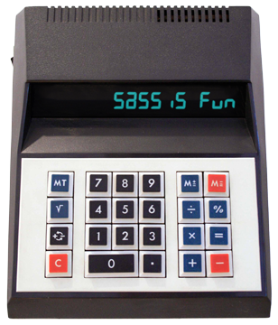

# Sass Calc

[](#travis)
[](#releases)
[](#license)
[](#download)

Easily build complex `calc()` expressions in Sass. Leverage `calc()` to do math that Sass can't.



Use `add()`, `subtract()`, `multiply()` and `divide()` on values which have incompatible or unknown units, or which are `var()` expressions, or which are `calc()` expressions themselves. Return a new `calc()` expression, or use straight math where possible.

```sh
# in your project
npm install --save @lunelson/sass-calc
```
```scss
// in your sass file, assuming you have 'node_modules' in Sass' search path
@import '@lunelson/sass-calc/index';
```
```scss
// test.scss
:root {
  --foo: 20px;
}
$expr: calc(100vw - 50%);
.test {
  test: subtract(1.5em, 1em);
  test: add(1.5em, 1rem);
  test: add(multiply($expr, 2), 10px);
  test: add(multiply(var(--foo), 2), 10px);
  test: divide(subtract(1.5em, 1em), 2);
  test: subtract(divide(subtract(1.5em, 1em), 2), add(1em, 1ex));
}
```
```css
/* test.css */
:root {
  --foo: 20px;
}

.test {
  test: 0.5em;
  test: calc(1.5em + 1rem);
  test: calc(((100vw - 50%) * 2) + 10px);
  test: calc((var(--foo) * 2) + 10px);
  test: 0.25em;
  test: calc(0.25em - (1em + 1ex));
}
```

Refs:

- https://www.sitepoint.com/sass-basics-operators/
- https://www.sitepoint.com/understanding-sass-units/
- http://caniuse.com/#feat=calc

Questions? [Twitter me.](https://twitter.com/lunelson)
